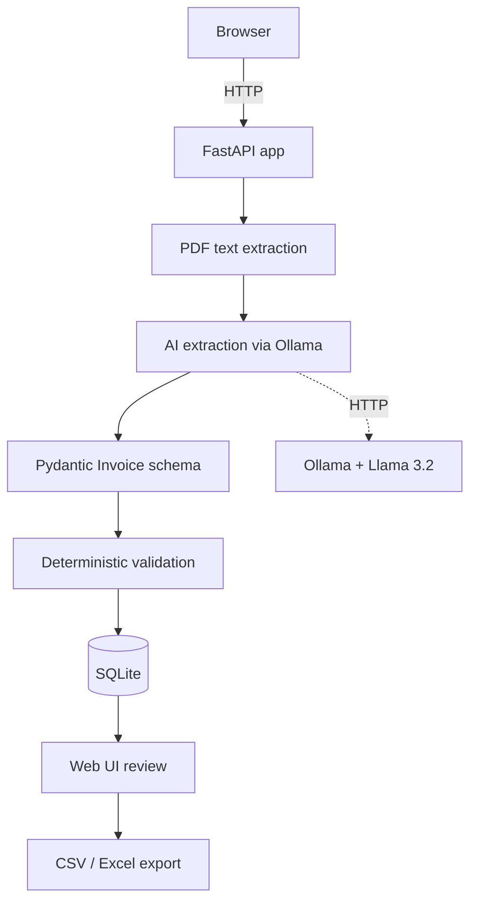

# Architecture

Voince is a single FastAPI process. There are no microservices, no message queue, and no external services except Ollama and (optionally) a payment provider.

---

## High-level view



---

## Request lifecycle — uploading an invoice

```
1.  User clicks "Process Invoice"           →  POST /upload
2.  FastAPI validates the file (type, size, %PDF)
3.  File is saved to uploads/ with a UUID prefix
4.  PDFExtractor reads text                 →  app/pdf.py
5.  Text is sent to Ollama                  →  app/ai.py
6.  Ollama returns JSON                     →  HTTP response
7.  JSON is parsed into Pydantic Invoice    →  app/schemas.py
8.  Validation rules are applied            →  app/validation.py
9.  Everything is persisted to SQLite       →  app/repository.py
10. Result page is rendered                 →  templates/result.html
```

---

## Project layout

```
invoice-mvp/
├── app/
│   ├── main.py                 # FastAPI app, all routes
│   ├── config.py               # Settings from .env (Pydantic Settings)
│   ├── database.py             # SQLite engine, session, migrations
│   ├── models.py               # SQLModel tables (User, Document, …)
│   ├── schemas.py              # Pydantic Invoice schema
│   ├── repository.py           # DB CRUD operations
│   ├── auth.py                 # Password hashing, sessions, current_user
│   ├── limiter.py              # Monthly invoice limits
│   ├── oauth.py                # Authlib OAuth providers (Google, GitHub)
│   ├── billing.py              # Balance, subscription, auto-renewal logic
│   ├── nowpayments.py          # NOWPayments API client
│   ├── pdf.py                  # PDFExtractor + PypdfExtractor
│   ├── ai.py                   # AIExtractor + OllamaInvoiceExtractor
│   ├── validation.py           # Deterministic business rules
│   ├── export.py               # CSV generation
│   ├── export_excel.py         # XLSX generation
│   ├── i18n.py                 # Translation dictionaries
│   ├── timing.py               # Per-stage timing helpers
│   ├── templates/              # Jinja2 templates
│   └── static/                 # CSS, favicon
├── scripts/
│   └── auto_renew.py           # Daily cron job for Pro renewals
├── tests/                      # pytest suite
├── uploads/                    # Uploaded PDFs (gitignored)
├── invoices.db                 # SQLite database (gitignored)
├── .env.example
├── pytest.ini
├── requirements.txt
└── README.md
```

---

## Responsibility of each module

### `app/main.py`

The single entry point of the application. Defines:

- All HTTP routes.
- Jinja2 template rendering.
- Session middleware.
- Startup hook (`init_db`).
- Global exception handler for `RequiresLogin`.

It does not contain business logic — that lives in the modules below.

### `app/config.py`

Loads settings from `.env` using Pydantic Settings. Provides a module-level singleton `settings` that is imported everywhere.

### `app/database.py`

Creates the SQLAlchemy engine and the `get_session` dependency. Also runs lightweight, idempotent migrations on startup — adding columns to existing SQLite tables when the model changes.

### `app/models.py`

SQLModel table definitions:

- `User` — account, plan, balance, subscription state, OAuth IDs.
- `Document` — an uploaded file, its owner, and its status.
- `InvoiceRecord` — extracted invoice header.
- `LineItemRecord` — extracted line items.
- `ValidationRecord` — validation outcome.
- `TopUp` — balance top-up attempts.
- `Transaction` — full ledger of balance movements.

### `app/schemas.py`

Pydantic models used for AI output and validation:

- `Invoice` — the top-level structure returned by the LLM and validated by Pydantic.
- `LineItem` — one row in `line_items`.

These are **the contract** between the AI and the rest of the code.

### `app/repository.py`

Wraps the database. All queries that touch a user's data filter by `user_id`, so data isolation is guaranteed at the repository level.

### `app/auth.py`

- Password hashing with bcrypt.
- Session helpers (`login_user`, `logout_user`).
- `get_current_user` / `get_current_user_optional` dependencies.
- `get_or_create_oauth_user` for OAuth account linking.

### `app/limiter.py`

Monthly invoice limit logic. Runs inside a `threading.Lock` so two concurrent uploads cannot both grab the last remaining slot.

### `app/oauth.py`

Authlib configuration for Google and GitHub. Registers the OAuth clients only if the corresponding credentials exist in `.env`.

### `app/billing.py`

Business logic for the internal balance model:

- `add_to_balance` — atomically updates the balance and writes a `Transaction`.
- `try_charge_and_activate` — charges the monthly fee and extends the Pro period.
- `auto_renew` — the daily job that renews active Pro users and downgrades expired ones.

### `app/nowpayments.py`

Thin HTTP client for the NOWPayments API:

- `create_payment` — creates a payment and returns the wallet address.
- `verify_ipn_signature` — verifies HMAC-SHA512 on incoming webhooks.

### `app/pdf.py`

`PDFExtractor` interface and one implementation (`PypdfExtractor`). Adding OCR means writing another implementation of the same interface — no other code changes.

### `app/ai.py`

`AIExtractor` interface and `OllamaInvoiceExtractor` implementation. Swapping the model or provider means writing another implementation of the same interface.

### `app/validation.py`

The deterministic business rules. Pure functions over `Invoice`. This is where arithmetic and required-field checks live. See [Validation](validation.md).

### `app/export.py` and `app/export_excel.py`

Convert invoice records to CSV and XLSX. Pure functions — no database access.

### `app/i18n.py`

Translation dictionaries for the four supported languages and a `t(key)` helper used by the templates.

### `app/timing.py`

A tiny `timer()` context manager that prints the duration of each pipeline stage. Purely for local development diagnostics.

---

## Why is it built this way?

A few deliberate choices:

- **Single process, single database.** The MVP needs to be easy to install, easy to debug, and easy to deploy on a small VPS. Microservices would add operational complexity for no real benefit at this stage.
- **Local AI.** Invoices are sensitive documents. Keeping the model local removes a whole class of privacy concerns and dependency on third-party APIs.
- **Interface-based PDF and AI.** The code does not care whether text comes from pypdf or OCR, or whether the LLM is Llama or something else. Two interfaces, two implementations today, more tomorrow.
- **Deterministic validation in Python.** The model extracts; Python decides. The validator never sees the LLM output — only the parsed `Invoice` object.
- **Session-based auth.** No JWTs, no token refresh flow. A signed cookie with a `user_id` is enough for a single-server app, and it is trivial to reason about.
- **Same templates for web and errors.** The same `result.html` renders a freshly-extracted invoice and a stored invoice; the difference is only where the data comes from.

---

## Data flow — one concrete example

Uploading a 1-page Acme invoice and approving it:

```
Browser                 FastAPI                 pypdf              Ollama
  │  POST /upload         │                       │                   │
  │ ────────────────────► │                       │                   │
  │                       │  read PDF             │                   │
  │                       │ ────────────────────► │                   │
  │                       │  text                 │                   │
  │                       │ ◄──────────────────── │                   │
  │                       │  prompt + text        │                   │
  │                       │ ────────────────────────────────────────► │
  │                       │  JSON                 │                   │
  │                       │ ◄──────────────────────────────────────── │
  │                       │  Pydantic + validation                    │
  │                       │  save to SQLite                           │
  │  HTML (result page)   │                                           │
  │ ◄──────────────────── │                                           │
  │                       │                                           │
  │  POST /invoices/1/approve                                         │
  │ ────────────────────► │  set status = approved                    │
  │  303 → /invoices/1    │                                           │
  │ ◄──────────────────── │                                           │
```

For more on the AI step, see [AI pipeline](ai-pipeline.md).